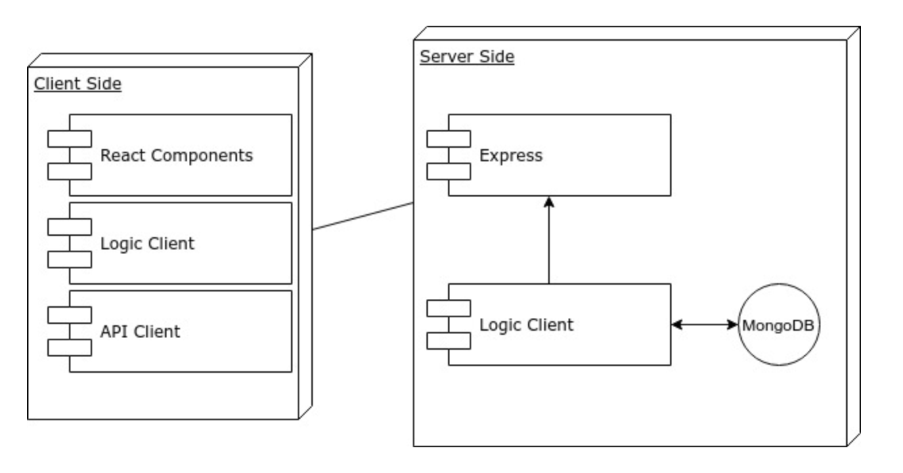

# Time2Padel

https://time2padel.herokuapp.com/

Time2Padel is an individual project that I have developed for SkylabCoders bootcamp, as the endpoint of all the course we did. 

It has been designed as a mobile first Application that give the users the chance to create their own teams to join the leagues you can find in a padel club. 

You must be registered to see the content of the page, once you do that you can find many information such as the club last news, the teams you ar part of, the requests you have received from other members of the Application to form teams and the list of leagues the club have available on that moment, filtered by level, date and time. 

User will be able to register in many leagues using the teams they have created with other users. 

## Features

    - Login & Register User
    - Navigate throw the website, click on the links and change to the different views using the header hamburguer menu.
    - Possibility to create your own teams, once you create them a request is send to the other user.
    - Possibility to confirm or cancel the requests, if confirmed the team is created and if dennied the team is dissolved.
    - Check the list of leagues available and possibility to register to them with any of the teams you are part of. 

## Functional Description

At Time2Padel, user will see an Application with information related to the padel club and the leagues they have available on that moment. User can also join every league they want.
 
Users information will be stored in a data base where we will later call them to recover the information required to form teams. This process will involve two users:

    1) Will make the registration using username and will add the username of the user who wants play with.
    2) The other user will receive a request and will have the possiblity to accept it or decline it. 

In the list of leagues available every user that have teams can join any league if the team has not been added yet. User can also see the details of the league:

- Teams already registered
- Starting date and playing days (only if the league is completed)

### Use cases

User can Log-In, Log-Out, Register, Find Leagues, Join a League, Accept Requests, Decline Requests and Check Results. 

## Flow

## Technical Description

### Components

List of the components used in the project:

    - App
    - Header
    - Footer
    - Feedback
    - Landing
    - Registration-page
    - Main
    - MyTeams
    - Userpage
    - Team
    - Team-creation
    - Team-registration
    - Mypendingteams
    - Pendingteam
    - Leagues
    - League-creation
    - League-detail
    - League-team
    - League
    - League-registration
    - Playingday
    
### Blocks

### Data Model 

## Test coverage

## TODO's

- Implement diferent roles (admin & users) to separate some actions as create leagues.
- Implement Results handshaking and make the admin responsible of confirming that both teams response is the same. 
- Implement new logics to add the selection by gender, and create MALE FEMALE & MIXED leagues. 
- Delete users, delete teams & delete leagues (must be really well controlled because the information is interconnected and can cause many conflicts in the leagues).
